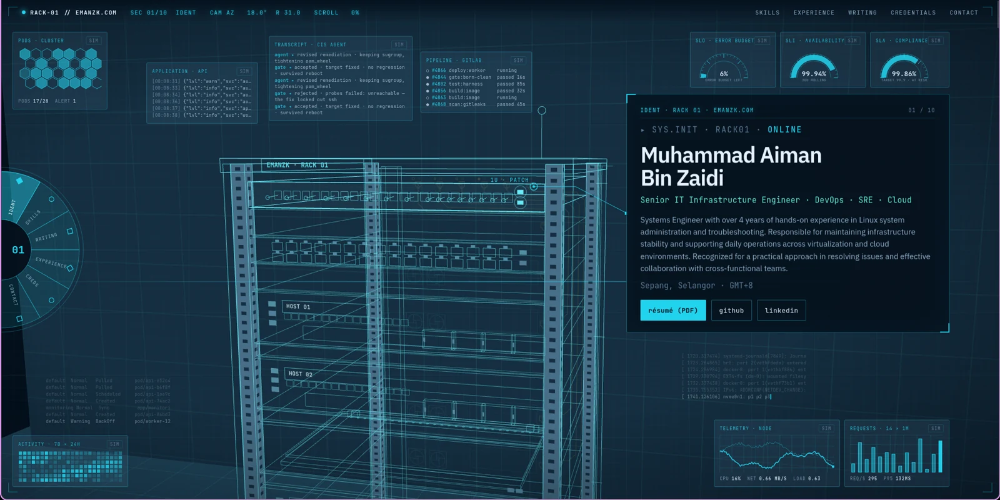

# emanzk.com

The portfolio served at **https://emanzk.com**.



Scroll drives a camera around a single object. Each section of the CV is a device in the rack,
and the panel is annotating the hardware rather than replacing it.

**Design rationale — why it looks and behaves the way it does — is in [DESIGN.md](DESIGN.md).**

```
src/                     <- the rack design, built by Eleventy
  _data/site.json          identity, skills, experience, credentials, section map
  _includes/               base layout, post layout, page chrome
  assets/                  rack.css  blog.css  rack.js  hud.js
  index.njk                the rack page
  blog/index.njk           the writing index
  blog/posts/*.md          one markdown file per post
dist/                    <- build output (gitignored), what gets deployed
.github/workflows/       <- build + deploy on push to main
wrangler.jsonc
eleventy.config.js
```

## How it is actually hosted

A **Cloudflare Worker** named `emanzk-portfolio`, serving static assets, with `emanzk.com` and
`www.emanzk.com` attached to it as custom domains.

**This repository is the source of truth.** `wrangler.jsonc` declares the Worker and both
custom domains; `.github/workflows/deploy.yml` builds and deploys on every push to `main`,
using a `CLOUDFLARE_API_TOKEN` repo secret. Two gates run before the deploy step:

- no page may contain `<pre class="mermaid">` — that means a diagram fell back to client-side
  rendering because its SVG was never committed
- no page may reference a file the build did not produce

`npm run diagrams` only invokes a headless browser for a diagram it has no SVG for, and every
SVG is committed, so CI needs no browser — and if one is ever missing the build fails there
rather than shipping a page that renders diagrams from a CDN.

## `src/` — the rack design

A scroll-driven blueprint of a server rack, in which each section of the CV is a device:
the switch carries the skills, a pull-out KVM console carries the writing, five servers carry
the roles, the UPS carries credentials, the PDU carries contact. The camera runs a shot list —
one angle per section — and the description panel is summoned on an indicator line drawn from
the device.

### Content

Everything on the site comes from data. Nothing is duplicated: the server name plates, the KVM
screen, the writing list and the blog index all read the same source.

| source | drives |
|---|---|
| `_data/site.json` | brand, rack label, hero, skills, experience (plates *and* panels), credentials, section order |
| `blog/posts/*.md` | the writing panel, the KVM screen, the blog index, and one page per post |

Adding a role is one object in `site.json` — the name plate, its typing animation and the panel
all follow. Adding a post is one markdown file.

### Build

```bash
npm install
npm run serve      # http://localhost:8100, rebuilds on save
npm run build      # writes dist/ exactly as CI does
```

Eleventy renders every panel at build time, so the markup ships complete — the scene boots into
a page that is already there, and the posts are real, indexable URLs (`/blog/perimeter-ids-dashboard/`)
rather than client-side routing.

> Markdown templating is deliberately **off** (`markdownTemplateEngine: false`) so that braces
> inside code blocks stay literal. Post permalinks are therefore computed in
> `blog/posts/posts.11tydata.js` rather than from a `{{ }}` string.

### Not done yet

- **Debug switches are still in the scripts** — `?p=`, `cam`, `hinge`, `seed`, `nomove`,
  `hudlog`, `perf`, `bus`, `nopanel`. Development scaffolding.
- **Reduced-motion is not handled** in the scene — for a site built on motion, that needs a
  real answer rather than a media query.
- **~500 draw calls per frame.** Fine on a desktop, marginal on a mid-range phone. Instancing
  the repeated geometry brings it to roughly 200.
- **Untested below 1100px**, where the instruments and radial menu currently hide entirely.
