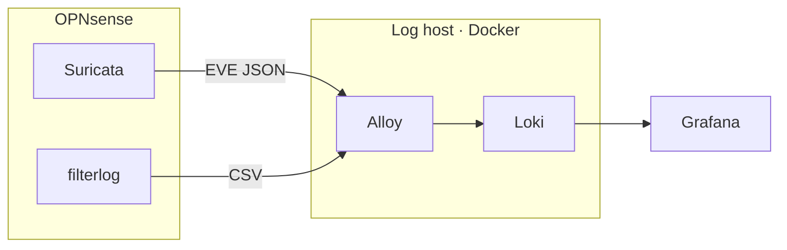
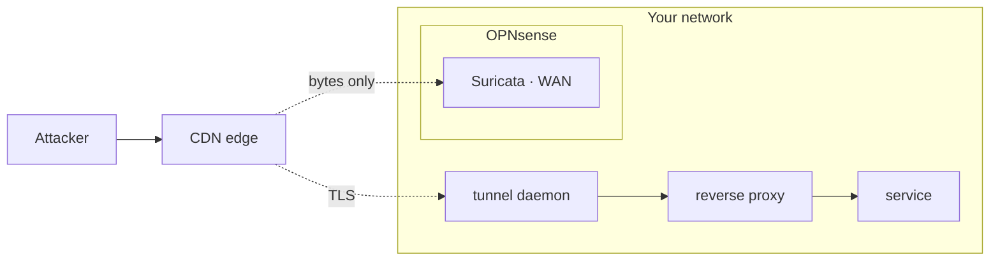

Most firewalls give you a block counter. It goes up, and that is the whole story it tells. Not who, not from where, not what they were reaching for.

Turning that counter into something you can query takes four parts: a sensor that inspects instead of counting, a way off the box, somewhere to land, and a dashboard.

## What you'll build



Alloy is where the work happens: it lifts fields out of each line into **labels**, and labels are what make a panel filterable.

## Before you start

| you need | notes |
|---|---|
| A firewall that runs Suricata | OPNsense or pfSense; anything that emits syslog works |
| A host for the stack | One small VM or LXC with Docker. Loki and Alloy both live there |
| Grafana | Existing instance is fine |
| Disk | Budget for retention — 30 days of firewall logs is not small |

<div class="callout">
<p><strong>Decide retention first.</strong> Loki accepts everything you send it. 30 days versus 7 is disk you keep buying.</p>
</div>

## Step 1 — Turn on the sensor

Enable Suricata in IDS mode on the **WAN interface**, then choose rulesets.


<div class="callout">
<p><strong>Don't enable everything.</strong> Rule count is what drives Suricata's memory, and at a WAN vantage point most rules can never fire — web-application rules need cleartext HTTP, and anything matching a URL or a body is blind against HTTPS. Enabling the lot cost me ~2 GB of RAM and zero extra detection.</p>
</div>

Ask of each ruleset: *can a packet matching this reach my sensor, in a form it can parse?* If not, it costs memory and returns nothing.

The 16 that survive that question here — 42,553 rules:

| ruleset | rules | what it gives you |
|---|---|---|
| `emerging-malware` | 26,470 | Beacon and C2. The one that earns its keep at home |
| `abuse.ch.sslblacklist` | 10,302 | TLS certificate fingerprints — works against encrypted traffic |
| `emerging-exploit` | 2,080 | Exploit attempts against anything you expose |
| `emerging-hunting` | 1,434 | Broad suspicious-behaviour rules |
| `tor` | 898 | Tor entry and exit nodes |
| `emerging-current_events` | 238 | Short-lived campaigns |
| `emerging-attack_response` | | Traffic that means a host already fell over |
| `emerging-coinminer` | | Mining pool traffic |
| `emerging-shellcode` | | Shellcode patterns on the wire |
| `botcc` · `drop` · `dshield` · `compromised` | | IP reputation — addresses are in the clear regardless of payload encryption |
| `abuse.ch.feodotracker` · `threatview_CS_c2` | | Known C2 infrastructure |
| `abuse.ch.sslipblacklist` | 0 | Enabled and empty — the feed carries nothing today |

Left off: `abuse.ch.threatfox` (83,018) and `abuse.ch.urlhaus` (30,237) were 65% of the original count on their own — IOC matching and plaintext URL matching, both dead ends at this vantage point. Then the whole web/SQL/exploit-kit family, `emerging-scan`, `emerging-dos`, `emerging-games`, and the OPNsense app-detect rulesets.

Download the rules, then **apply** them. Two separate actions — see *Troubleshooting*.

## Step 2 — Ship the logs

Point the firewall's syslog at the host that will run the stack.


**System → Settings → Logging / Targets → +**

| field | value |
|---|---|
| Transport | UDP |
| Applications | `filterlog`, `suricata` |
| Hostname | your stack host |
| Port | `514` |

The second row in that screenshot is a separate TCP path for EVE JSON — extra, not needed here. `suricata` carries IDS alerts as EVE JSON. `filterlog` carries every pass and block — much higher volume, and the source of the map and rate panels.

## Step 3 — Land them

Three files in one directory. `docker-compose.yml` first:

```yaml docker-compose.yml
services:
  loki:
    image: grafana/loki:3.4
    command: -config.file=/mnt/loki-stack/loki.yaml
    ports: ["3100:3100"]
    volumes:
      - .:/mnt/loki-stack:ro
      - loki-data:/loki
    restart: unless-stopped

  alloy:
    image: grafana/alloy:latest
    command:
      - run
      - /mnt/loki-stack/alloy.conf
      - --server.http.listen-addr=0.0.0.0:12345
      - --stability.level=generally-available
    ports:
      - "514:514/udp"
      - "12345:12345"
    volumes:
      - .:/mnt/loki-stack:ro
      - ./geoip:/mnt/geoip:ro
    depends_on: [loki]
    restart: unless-stopped

volumes:
  loki-data:
```

Then `loki.yaml` — single binary, filesystem storage, 30-day retention:

```yaml loki.yaml
auth_enabled: false

server:
  http_listen_address: "0.0.0.0"
  http_listen_port: 3100

common:
  ring:
    instance_addr: 127.0.0.1
    kvstore: { store: inmemory }
  replication_factor: 1
  path_prefix: /loki

schema_config:
  configs:
    - from: "2024-01-01"
      store: tsdb
      object_store: filesystem
      schema: v13
      index: { prefix: index_, period: 24h }

storage_config:
  tsdb_shipper:
    active_index_directory: /loki/index
    cache_location: /loki/index_cache
  filesystem:
    directory: /loki/chunks

compactor:
  working_directory: /loki/compactor
  compaction_interval: 10m
  retention_enabled: true          # off by default — nothing is ever deleted without this
  retention_delete_delay: 2h
  delete_request_store: filesystem

limits_config:
  retention_period: 720h           # 30 days
  reject_old_samples: true
  reject_old_samples_max_age: 168h
  ingestion_rate_mb: 8             # firewall logs will hit this before you expect
  ingestion_burst_size_mb: 16

ingester:
  chunk_idle_period: 30m
  chunk_retain_period: 1m
  wal:
    dir: /loki/wal

querier:
  max_concurrent: 4

analytics:
  reporting_enabled: false
```

Two lines matter more than the rest. `retention_enabled: true` is **off by default** — without it `retention_period` is ignored and the disk fills silently. And `ingestion_rate_mb` is the ceiling a busy `filterlog` stream hits first; when it does, Loki drops lines and the dashboard just looks quiet.

Then `alloy.conf` — four blocks: receive, relabel, parse, write.

```river alloy.conf
loki.source.syslog "opnsense" {
  listener {
    address            = "0.0.0.0:514"
    protocol           = "udp"
    syslog_format      = "rfc3164"
    max_message_length = 65536
    labels             = { job = "opnsense" }
  }
  relabel_rules = loki.relabel.syslog.rules
  forward_to    = [loki.process.filterlog.receiver]
}

// syslog envelope -> labels. appname is what separates the two sources.
loki.relabel "syslog" {
  forward_to = []
  rule { source_labels = ["__syslog_message_hostname"] target_label = "hostname" }
  rule { source_labels = ["__syslog_message_app_name"] target_label = "appname"  }
  rule { source_labels = ["__syslog_message_severity"] target_label = "severity" }
  rule { source_labels = ["__syslog_message_facility"] target_label = "facility" }
}

// filterlog is positional CSV:
// rule,subrule,anchor,tracker,interface,reason,action,direction,ip_version,...
// IPv4 then adds: tos,ecn,ttl,id,offset,flags,proto_id,proto,length,src_ip,dst_ip,...
loki.process "filterlog" {
  forward_to = [loki.write.default.receiver]

  stage.match {
    selector = "{appname=\"filterlog\"}"

    stage.regex {
      expression = "^(?P<rule>[^,]*),(?P<subrule>[^,]*),(?P<anchor>[^,]*),(?P<tracker>[^,]*),(?P<interface>[^,]*),(?P<reason>[^,]*),(?P<action>[^,]*),(?P<direction>[^,]*),(?P<ip_version>[^,]*),(?P<remainder>.*)$"
    }
    stage.labels {
      values = { action = "", direction = "", interface = "", ip_version = "" }
    }

    stage.match {
      selector = "{ip_version=\"4\"}"

      stage.regex {
        source     = "remainder"
        expression = "^(?P<tos>[^,]*),(?P<ecn>[^,]*),(?P<ttl>[^,]*),(?P<id>[^,]*),(?P<offset>[^,]*),(?P<flags>[^,]*),(?P<proto_id>[^,]*),(?P<proto>[^,]*),(?P<length>[^,]*),(?P<source_ip>[^,]*),(?P<dest_ip>[^,]*),(?P<ip_remainder>.*)$"
      }
      stage.labels { values = { proto = "" } }

      stage.geoip {
        source  = "source_ip"
        db      = "/mnt/geoip/GeoLite2-City.mmdb"
        db_type = "city"
      }
      stage.labels {
        values = { geoip_country_name = "", geoip_city_name = "" }
      }

      // addresses are unbounded — metadata, never labels
      stage.structured_metadata {
        values = { source_ip = "", dest_ip = "" }
      }

      stage.match {
        selector = "{proto=~\"tcp|udp\"}"
        stage.regex {
          source     = "ip_remainder"
          expression = "^(?P<src_port>[^,]*),(?P<dst_port>[^,]*).*$"
        }
        stage.structured_metadata {
          values = { src_port = "", dst_port = "" }
        }
      }
    }
  }
}

loki.write "default" {
  endpoint { url = "http://loki:3100/loki/api/v1/push" }
}
```

Now start it, and verify before moving on:

```bash
curl -s localhost:3100/ready          # Loki: "ready"
curl -s localhost:12345/-/ready       # Alloy: OK
```


Every component should read *Healthy*. If they are and nothing arrives, the problem is the firewall's syslog target or the UDP/514 path, not the parser.

## Step 4 — Choose your labels

The split at the bottom of `alloy.conf` is the part worth thinking about: `action`, `proto`, `interface` and the geoip names become **labels** because you group by them. Addresses and ports become **structured metadata** — searchable, but they don't create a stream each.

<div class="callout">
<p><strong>Lift a field only if you will filter or group by it.</strong> Every label multiplies the streams Loki tracks, and a high-cardinality one — a source port, say — will wreck query performance.</p>
</div>

## Step 5 — Query it

Add Loki as a datasource (`http://loki:3100` if they share a network) and check you see data:

```logql
{appname="filterlog"} | line_format "{{.__line__}}"
sum by(action)(count_over_time({appname="filterlog"}[5m]))
```

Suricata's detail is **nested** under an `alert` object, so the path matters:

```logql
{appname="suricata"}
  | json sig="alert.signature", sev="alert.severity", category="alert.category"
```

Dotted path, not `alert_signature`. Get this wrong and the panel still renders — see below.

## Step 6 — Build the dashboard


1. **Alert table** — timestamp, signature, severity, source, destination. Your most-read panel.
2. **Block rate over time** — `filterlog` with `action="block"`. Shape matters more than the number; a step change is the signal.
3. **Top blocked sources** — a table, not a pie chart.
4. **Geographic map** — a choropleth, if you added geoip.
5. **Ingest health** — the rate of lines arriving.

<div class="callout">
<p><strong>Build the ingest-health panel.</strong> Every other panel looks calm and healthy when ingestion has stopped. An empty alert table and a working one with nothing to report render identically.</p>
</div>

## Troubleshooting

Nothing here throws an error. Every one of these looks like a working dashboard.

| what you see | where to fix it | fix |
|---|---|---|
| Grafana alert table renders rows, but the signature and severity columns are empty | Grafana — the panel query | `\| json` named a field that doesn't exist and returned `""`. Use the dotted path: `alert.signature`, not `alert_signature` |
| Grafana map or top-sources panel totals are far below your raw log volume | Grafana — the panel query | You grouped by a label that covers only some streams. `label=~".+"` is a filter — group by one with full coverage |
| OPNsense shows the new rulesets ticked, but the alerts you expected never appear | OPNsense — Intrusion Detection | Downloaded is not applied; separate actions. Apply, then check the *running* rule count |
| Every Grafana panel renders but stops at an old timestamp | OPNsense syslog target, then the network | Check Alloy on `:12345` first — if `loki.source.syslog` is healthy and idle, the problem is upstream of Docker |
| Grafana panels take tens of seconds or time out | Alloy — the label set | A high-cardinality label, usually source port. Drop it from the labels; it stays in the message body |

Compare two labels when a number looks wrong:

```logql
sum by(geoip_country_code)(count_over_time({appname="filterlog",action=~"block|deny"}[24h]))  # 1,660
sum by(geoip_country_name)(count_over_time({appname="filterlog",action=~"block|deny"}[24h]))  # 19,854
```

## Limits



<div class="callout">
<p><strong>One sensor, one vantage point.</strong> Catches beaconing to known-bad addresses, blocklisted infrastructure, bad certificate fingerprints. Misses anything inside TLS, attacks on services you publish through a tunnel — that arrives as an outbound encrypted session, not HTTP requests — and lateral movement on your own LAN.</p>
</div>

And there you go — your own perimeter dashboard. Give it a week of real traffic before you start tuning; you'll be surprised what shows up.
