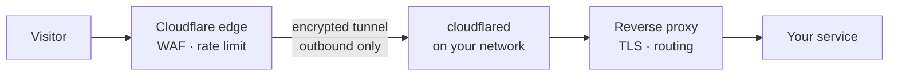
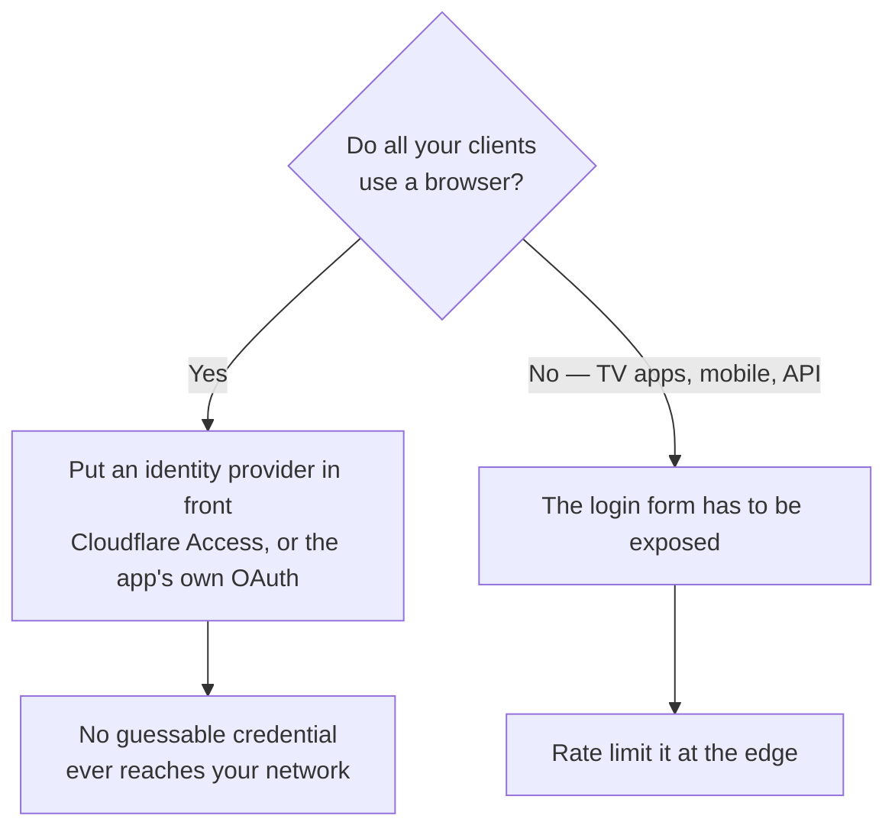
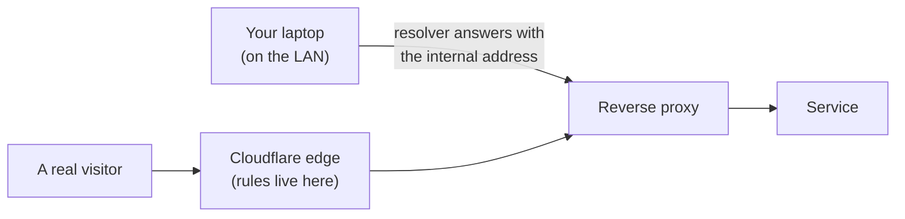

You have something running at home — a media server, a dashboard, an API — and you want to reach it from outside without forwarding a port and without a VPN on every device.

This walks through the whole thing: the tunnel, the decision about what guards the front door, a rate limit on the login endpoint, and the verification step that most guides skip. It takes about an hour, and you can do it on a free Cloudflare plan.

## What you'll build



The important property: **no inbound port is ever opened.** `cloudflared` dials *out* to Cloudflare and holds the connection. Your firewall keeps refusing everything from the internet, and traffic still gets in. Nothing on your network is discoverable by a port scan.

## Before you start

You'll need:

| you need | notes |
|---|---|
| A domain on Cloudflare | Nameservers pointed at Cloudflare — free plan is fine |
| A reverse proxy | Caddy, nginx, Traefik — anything that terminates TLS and routes by hostname |
| A real TLS certificate | A wildcard via DNS-01 is easiest; self-signed will cause you pain later |
| The service itself | Running, reachable on your LAN, with its own login |

<div class="callout">
<p><strong>Get the certificate first.</strong> A lot of the pain in this setup comes from trying to bolt a tunnel onto a proxy using self-signed certificates. Sort the certificate out before you start and the rest is straightforward.</p>
</div>

## Step 1 — Run the tunnel

Install `cloudflared` on something that's always on. A firewall appliance or a small always-on box is better than a container that might be down when you need remote access.

In the Cloudflare dashboard: **Zero Trust → Networks → Tunnels → Create a tunnel**. Choose the connector for your platform, and copy the token it gives you.

<div class="callout">
<p><strong>Treat that token as a credential.</strong> Anyone holding it can run your tunnel. Don't paste it into a chat, a screenshot, or a config file that ends up in git.</p>
</div>

Start the connector with the token. Within a few seconds the dashboard should show it **HEALTHY** with one or more connections.

**Verify before moving on:**

```bash
systemctl status cloudflared     # active (running)
```

If it's flapping, the token is wrong or the box can't reach Cloudflare on 443 outbound.

## Step 2 — Point a hostname at the service

Still in the tunnel config, add a **public hostname**.


| field | value |
|---|---|
| Subdomain | `app` |
| Domain | `example.com` |
| Type | **HTTPS** |
| URL | your reverse proxy's address and port `443` |
| Origin Server Name | `app.example.com` |

Two of those matter more than they look.

**Type must be HTTPS, not HTTP.** If your proxy redirects HTTP to HTTPS — and it almost certainly does — an HTTP origin gets a 308 back, the tunnel follows it, and you get a redirect loop. This is the single most common failure in this setup.

**Origin Server Name** tells the tunnel which name to expect on your proxy's certificate. Without it, the certificate won't match and the connection fails.

Saving the hostname creates the public DNS record for you. Give it a minute, then:

```bash
curl -sI https://app.example.com | head -3
```

You want a `200` or a `302` from your service. A `502` means the tunnel can't reach the proxy; a redirect loop means Step 2's type is wrong.

## Step 3 — Decide what guards the front door

This is the step people skip, and it's the one that matters.



If every client is a browser, **put an identity provider in front and stop here.** Cloudflare Access or the app's own OAuth means no password is ever guessed against your service, because an attacker never reaches the login form.

If you have native clients — a TV app, a phone app, anything that can't complete a browser redirect — Access will break them. The login form has to be public, and you need a rate limit instead.

## Step 4 — Rate limit the login endpoint

<div class="callout">
<p><strong>Put the limit at the edge, not on your proxy.</strong> Your proxy sets its client-IP header from the immediate peer, and for tunnel traffic that peer is <code>cloudflared</code> — so every visitor on earth arrives wearing the same address. A per-IP limit there counts the whole internet as one client and bans the tunnel on the first burst, taking down all remote access. It causes precisely the outage it was meant to prevent.</p>
</div>

**Security → Security rules → Create rule → Rate limiting rules.**


Use the expression editor rather than the visual builder:

```
(http.host eq "app.example.com"
 and http.request.method eq "POST"
 and lower(http.request.uri.path) contains "authenticate")
```

Then: characteristic **IP**, **5** requests per **10 seconds**, action **Block**, duration **10 seconds**. On a free plan those are the only values available, and you get one rule for the whole zone — so spend it on the login endpoint.

### Why `lower()` is not decoration

Find your app's real login path first — check its API docs or watch the browser's network tab while you log in.

Then check whether its routing is case-sensitive:

```bash
curl -so /dev/null -w '%{http_code}\n' -X POST https://app.example.com/users/authenticatebyname
curl -so /dev/null -w '%{http_code}\n' -X POST https://app.example.com/Users/AuthenticateByName
```

**401 from both** means routing is case-insensitive — most frameworks are. A rule matching the documented path exactly would then be defeated by changing one letter, which is why the expression case-folds. A **404** means that path doesn't exist, so you have the wrong endpoint.

Using `contains "authenticate"` rather than an exact path also catches the app's other auth endpoints in the same rule — worth it when you only get one.

## Step 5 — Verify it, properly

Here's where almost everyone goes wrong, including me, three times in a row.

If you run split-horizon DNS — your internal resolver answering for the same domain — then a `curl` from your own network **never reaches Cloudflare at all**:



You get a real response from the real service, with every edge rule bypassed. Nothing looks wrong. The tell is latency — if it comes back in 20ms, that's your LAN, not the internet.

Confirm what you actually connected to:

```bash
curl -so /dev/null -w '%{remote_ip}  %{time_total}s\n' https://app.example.com/
```

If that prints a private address, you measured the wrong path.

**Pin the request to Cloudflare instead.** Get a public address for your zone from a public resolver, then force it:

```bash
EDGE=$(dig +short app.example.com @1.1.1.1 | head -1)

for i in $(seq 1 12); do
  curl -so /dev/null -w '%{http_code} ' -X POST \
    --resolve "app.example.com:443:$EDGE" \
    https://app.example.com/users/authenticatebyname
done; echo
```

Expected: **five `401`s, then `429`s.** The 401s reached your service and were rejected; the 429s were blocked at the edge.

<div class="callout">
<p><strong>Use one edge address for the whole test.</strong> Below Enterprise, rate-limit counters are kept per data centre. Spread your burst across several anycast addresses and the count splits, nothing trips, and you'll conclude the rule is broken when it isn't.</p>
</div>

Finally, check you haven't caught normal traffic — a request that doesn't match the rule should still succeed:

```bash
curl -so /dev/null -w '%{http_code}\n' --resolve "app.example.com:443:$EDGE" \
  https://app.example.com/some/public/endpoint
```

## Troubleshooting

| what you see | where to fix it | fix |
|---|---|---|
| Browser loops until it gives up | Cloudflare — tunnel public hostname | Origin is set to HTTP while your proxy redirects to HTTPS. Change the origin to HTTPS |
| `502 Bad Gateway` from the edge | Your network — the proxy | The tunnel can't reach the proxy: wrong address, wrong port, or the proxy is down |
| Tunnel logs a certificate error | Cloudflare — tunnel public hostname | **Origin Server Name** is missing or doesn't match the certificate the proxy presents |
| Burst of requests, no `429` ever | Your terminal, not the rule | You resolved through your own DNS and hit the proxy directly, or spread the burst across several edge addresses |
| One request with odd capitalisation gets through | Cloudflare — the rule expression | Expressions are case-sensitive. Wrap the path in `lower()` |
| A phone or TV app stops connecting | Cloudflare — Access policy | Access expects a browser login. Don't put it in front of anything that can't render one |

## Be honest about what this buys

Five requests per ten seconds with a ten-second block still allows roughly **fifteen guesses a minute**, sustained. That's a speed bump, not a wall.

Two things help more, and both are free:

**Check whether your app's lockout is actually on.** Many expose the setting, count failed attempts faithfully, and never act on the count because the threshold is unset. Look at the real value, not the settings page.

**Rename the default account.** The username is half the credential. If yours is still `admin`, an attacker needs to guess one secret instead of two — and blind brute force can't even begin without a valid username.

<div class="callout">
<p><strong>If you enable lockout, add a second admin account first.</strong> On a single-account server, lockout turns a brute-force attempt into a guaranteed denial of service that an attacker can trigger deliberately — and recovery means database surgery.</p>
</div>

## Where to go next

- Turn on access logging at your proxy, so you have a local record of who reached what.
- Restore real client IPs at the proxy with a trusted-proxy setting — but **verify the tunnel's source address first**, because a range wider than the truth lets anyone spoof their own IP with a header.
- Add a synthetic check that requests the endpoint from outside and alerts if it stops returning what you expect.
